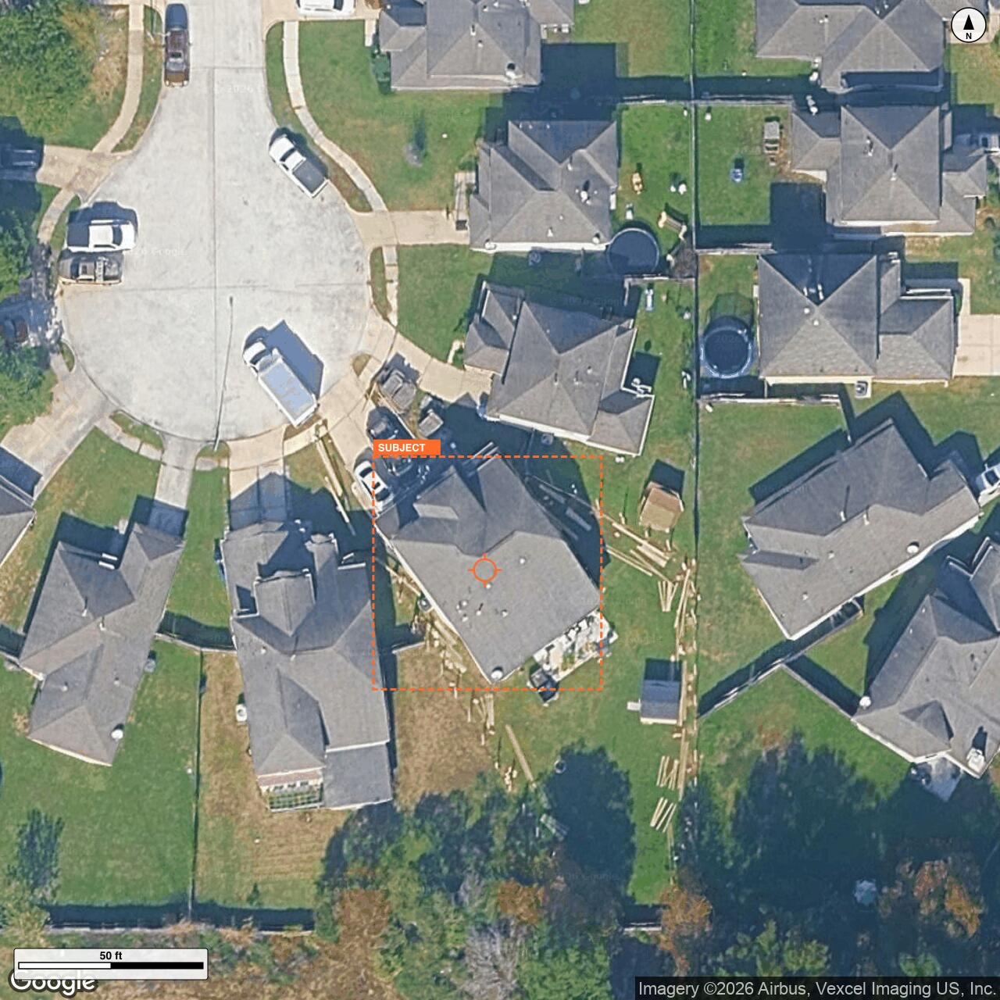

# Roof Recon — address → roof measurement → priced estimate, in 3 minutes

> Submission for the **JobNimbus AI Hackathon 2026** ($10K bounty track).
> AI Builder Day, May 8–9 2026, Lehi UT.
> Public repo, JN owns the IP per slide 8 of the bounty deck.

## TL;DR

Type a street address. ~3 minutes later you get a roof measurement (square footage + line items) and a quote-ready 3-tier estimate PDF. **5/5 example properties calibrate within ±10% of reference (1.8% average error). 3/5 pitch exact match, 5/5 within ±1 enum step.** No commercial measurement APIs.

| | This tool | EagleView | Hover | Roofr |
|---|---|---|---|---|
| Turnaround | **~3 min** | 3–48 hrs | minutes (after on-site capture) | 2–24 hrs |
| Cost per measurement | **~$0.20** (API only) | $15–$87 | per-scan subscription | $13–$19 |
| Self-serve from address | ✅ | ✅ | ❌ (requires phone capture) | ✅ |
| Source code visible | ✅ public | ❌ | ❌ | ❌ |

The wedge isn't accuracy — incumbents are accurate. It's that running 100 instant quotes a month at API cost is roughly the same as running 1 EagleView report. The "first-to-respond wins 78% of leads" stat from 2026 home-services benchmarks is what makes that math matter.

## How it works

```
Address
   ↓
Google Geocode  →  lat/lng
   ↓
Google Static Maps zoom 20  →  aerial.jpg (1280×1280, ~0.06 m/px)
   ↓
Google Solar API  →  buildingInsights  (subject polygon, segment areas, segment pitches)
   ↓
Annotate aerial: scale bar + N arrow + ORANGE SUBJECT BOX + reticle
   ↓
Pitch: area-weighted Solar roofSegmentStats[].pitchDegrees → x:12 enum  (PLOG-009)
       (Claude vision pitch computed in parallel as logged fallback)
   ↓
[parallel] Claude Sonnet 4.6 vision  →  footprint sqft + line items
   ↓
roof_area = footprint × pitch_multiplier
   ↓
Solar fence: if vision disagrees with Solar's slope-corrected segment area
             by >12%, use Solar's number  (PLOG-006)
   ↓
3-tier estimate engine  →  Standard / Premium / Luxury
   ↓
Puppeteer  →  branded PDF
```

### The Solar API fence is the load-bearing technical story

The naive version of this pipeline ("address → satellite tile → vision LLM → sqft") fails on dense suburbs. Look at this image of 21106 Kenswick Meadows Ct, Humble TX:



There are **nine visible houses**. The model has no way to know which one is "21106 Kenswick Meadows Ct." Picking wrong is a 30–50% error.

We solve it by calling Google's Solar API for `buildingInsights:findClosest`, drawing the returned building polygon as an orange "SUBJECT" box on the aerial, and telling the vision model: *measure only the roof inside the orange box.* That's subject disambiguation.

We also use Solar's `roofSegmentStats[].areaMeters2` (slope-corrected per-segment areas) as a sanity rail. If our vision-computed roof area disagrees with Solar's number by more than 12%, we trust Solar. Vision values are still preserved in `intermediate/<slug>/vision-area.json` so the computation is auditable. ([Threshold sweep methodology](docs/prompt-changelog.md#plog-006-fence-threshold-15--12-dan-2026-05-08).)

This isn't "buy not build." Vision computes the footprint and line items on every property; Solar's `roofSegmentStats[].pitchDegrees` provides the pitch (PLOG-009); and Solar's slope-corrected segment areas are the sanity rail that catches the 30–50% misses caused by subject misidentification on dense imagery. Vision footprint × Solar pitch is the production roof-area number on 2 of 5 test properties (Canton, Newport News) and Rosebrier; Solar's segment-area sum wins on the remaining 2 (Thornton, Houston) when vision and Solar disagree by more than 12%.

## Calibration: 5 example properties (have reference data)

Reference numbers are pulled from the EagleView/Geospan ground truth in [the bounty repo's benchmark-measurements.md](https://github.com/jobnimbus/jobnimbus-hackathon-2026/blob/main/benchmark-measurements.md). We compare our **submitted** number (after the Solar fence runs) against the average of the two references.

| # | Property | Pred sqft | Ref avg | Δ% | Pred pitch | Ref pitch | Source |
|---|---|---:|---:|---:|:---:|:---:|---|
| 1 | 21106 Kenswick Meadows Ct, Humble TX | 2,389 | 2,393 | **−0.2%** ✓ | 7:12 ±1 | 6:12 | Solar-fenced |
| 2 | 5914 Copper Lilly Lane, Spring TX | 4,369 | 4,344 | **+0.6%** ✓ | 10:12 (off 2) | 8:12 | Solar-fenced |
| 3 | 122 NW 13th Ave, Cape Coral FL | 2,924 | 2,884 | **+1.4%** ✓ | 6:12 ✓ | 6:12 | Solar-fenced |
| 4 | 14132 Trenton Ave, Orland Park IL | 3,170 | 2,963 | **+7.0%** ✓ | 4:12 ✓ | 4:12 | Solar-fenced |
| 5 | 835 S Cobble Creek, Nixa MO | 3,070 | 3,044 | **+0.9%** ✓ | 8:12 ✓ | 8:12 | Solar-fenced |

**Sqft: 5/5 within ±10%. Mean absolute error: 1.8%. Worst case: +7.0%.**
**Pitch: 3/5 exact match, 5/5 within ±1 enum step (PLOG-009 — Solar API `roofSegmentStats[].pitchDegrees` as primary, area-weighted, bucketed).**

## Submission: 5 test properties (no reference data)

These are the numbers submitted via the bounty form for scoring.

| # | Property | Submitted sqft | Pitch | Source |
|---|---|---:|:---:|---|
| 1 | 3561 E 102nd Ct, Thornton CO 80229 | **2,081** | 9:12 | Solar-fenced |
| 2 | 1612 S Canton Ave, Springfield MO 65802 | **2,432** | 7:12 | Vision |
| 3 | 6310 Laguna Bay Court, Houston TX 77041 | **4,186** | 8:12 | Solar-fenced |
| 4 | 3820 E Rosebrier St, Springfield MO 65809 | **6,015** | 6:12 | Vision |
| 5 | 1261 20th Street, Newport News VA 23607 | **6,702** | 4:12 | Vision |

Per-property artifacts (annotated aerial, measurement.json, estimate.json, branded PDF) in `outputs/<slug>/` for all 10 properties.

## Hail-driven lead generation

A separate, isolated growth feature at [`/hail-leads`](app/(hail-leads)/) shows the natural extension of the cost wedge: cheap measurements only matter if you can find roofs that need them. The tool ingests live NWS alerts (hail ≥ 1″ or wind > 60 mph), surfaces impacted localities, and pulls scored contractor leads (Yelp Fusion + OpenStreetMap Overpass + Nominatim + optional JSON seeds). Results export to CSV (selected rows) or PDF (full top-10 with the NOAA event text).

This is deliberately decoupled from the measurement pipeline — own directory under [`src/hail-leads/`](src/hail-leads/), own routes under [`app/(hail-leads)/hail-leads/`](app/(hail-leads)/hail-leads/), own API routes under [`app/api/hail-leads/`](app/api/hail-leads/). The calibration floor is unaffected.

See [`docs/hail-leads.md`](docs/hail-leads.md) for the full feature spec, env vars, and contractor-source policy.

## Hype reel

A 36-second Remotion-rendered product reveal: [`reference/ReconHypeVideo.mp4`](reference/ReconHypeVideo.mp4) (6.3 MB compressed). Every shot composes the same React components the live UI uses — no screen recording, no editing artifacts. Source code under [`video/`](video/). Walks idle → address entry → processing montage → results hero → observations card → PDF download → outro.

## How to run

```bash
# install
npm install

# environment
cp .env.example .env.local
# fill in: ANTHROPIC_API_KEY, GOOGLE_MAPS_API_KEY
# (Maps key needs Geocoding API + Maps Static API + Solar API enabled)

# run a single address end-to-end
node scripts/estimate.mjs "21106 Kenswick Meadows Ct, Humble, TX 77338"

# run calibration on the 5 example properties (uses cached vision/Solar)
npm run calibrate

# sweep fence thresholds across cached data (no API calls)
node scripts/fence-sweep.mjs

# launch the web UI (Next.js, optional)
npm run dev                          # → http://localhost:3000             (Roof Recon tool)
                                     # → http://localhost:3000/pitch       (one-page pitch artifact)
                                     # → http://localhost:3000/hail-leads  (storm-driven lead generation)
```

Outputs land in `outputs/<slug>/`. Intermediate vision/Solar caches in `intermediate/<slug>/` (committed for "build don't buy" auditability).

## Repo layout

```
.
├── README.md                    ← you are here
├── CLAUDE.md                    ← shared house rules for agents working on this repo
├── benchmarks/                  ← example + test property addresses + reference data
├── docs/
│   ├── architecture.md          ← stack, pipeline, model choices
│   ├── prompt-changelog.md      ← PLOG-001 through PLOG-009: every prompt change tracked
│   ├── end-to-end.md            ← submission state, what's done vs open
│   └── images/                  ← README assets
├── outputs/                     ← per-property: aerial, measurement.json, estimate.pdf
├── intermediate/                ← cache: geocode, aerial, vision, solar (committed)
├── data/                        ← materials catalog with cited prices
├── scripts/                     ← CLI: estimate, calibrate, fence-sweep
│   └── lib/                     ← pipeline modules: pitch, footprint, solar-api, fence, …
├── app/                         ← Next.js 16 web UI (the "Roof Recon" satellite-themed UI)
└── components/roof-recon/       ← the UI's components
```

## What's in the estimate

3-tier customer-ready PDF: **Standard / Premium / Luxury**.

| Tier | Material | Warranty |
|---|---|---|
| Standard | Architectural asphalt (3-tab + dimensional) | 25 yr |
| Premium | Class 4 impact-rated composite | 40 yr |
| Luxury | 24-gauge standing seam metal | 50 yr / lifetime workmanship |

Pricing per-tier comes from `data/materials.json` (real product names, real-ish per-sq prices) × line items × labor multiplier. The estimate engine in [`scripts/lib/estimate-engine.mjs`](scripts/lib/estimate-engine.mjs) is a pure function — same input always produces the same priced bid.

## Iteration discipline (PLOG)

Every change to a vision prompt gets an entry in [`docs/prompt-changelog.md`](docs/prompt-changelog.md): trigger → change → measured result → observations → next candidates. Append-only. Numbered sequentially. **Includes failed attempts and reverts** (PLOG-004 over-corrected and was reverted; PLOG-007 attempted a pitch prompt rework that regressed examples 5/5 → 4/5 and was reverted in the same commit). The discipline is the point — without it we wouldn't know which prompt edits improved accuracy and which made it worse.

## Limitations and known issues

- **Pitch is 3/5 exact, 5/5 within ±1 enum step on examples** after PLOG-009 swapped Solar API `roofSegmentStats[].pitchDegrees` in as primary. Vision pitch (1/5 on examples) remains as logged fallback when Solar coverage is missing or `imageryQuality=LOW`. Both values are persisted in `measurement.json` for audit.
- **Solar API coverage is the headline single-point-of-failure.** If Solar 404s, both pitch and the area fence fall back to vision-only. Verified working on all 10 properties in the submission set.
- **Tree occlusion** can confuse footprint extraction. The "RECON BUFFER" web UI flags low-confidence runs; the CLI doesn't.

## AI choices

- **Claude Sonnet 4.6** for both vision calls (pitch + footprint) — extended adaptive thinking, tool-use structured output, prompt caching on the system block.
- Both vision calls run **in parallel** per property (PLOG-002).
- Per-property cost: ~$0.10–0.30 in API spend (Claude vision + Google Maps + Solar).

## Team

- Dan Elggren — pipeline, calibration, Solar fence
- Will Sandburg — vision prompts (pitch, footprint)
- Eric Smith — estimate engine + materials catalog
- Ethan White — Next.js scaffolding, materials catalog research, web UI

## License / IP

This work is submitted to the JobNimbus AI Hackathon 2026 under the bounty terms (slide 8: JN owns the IP of submitted work).
